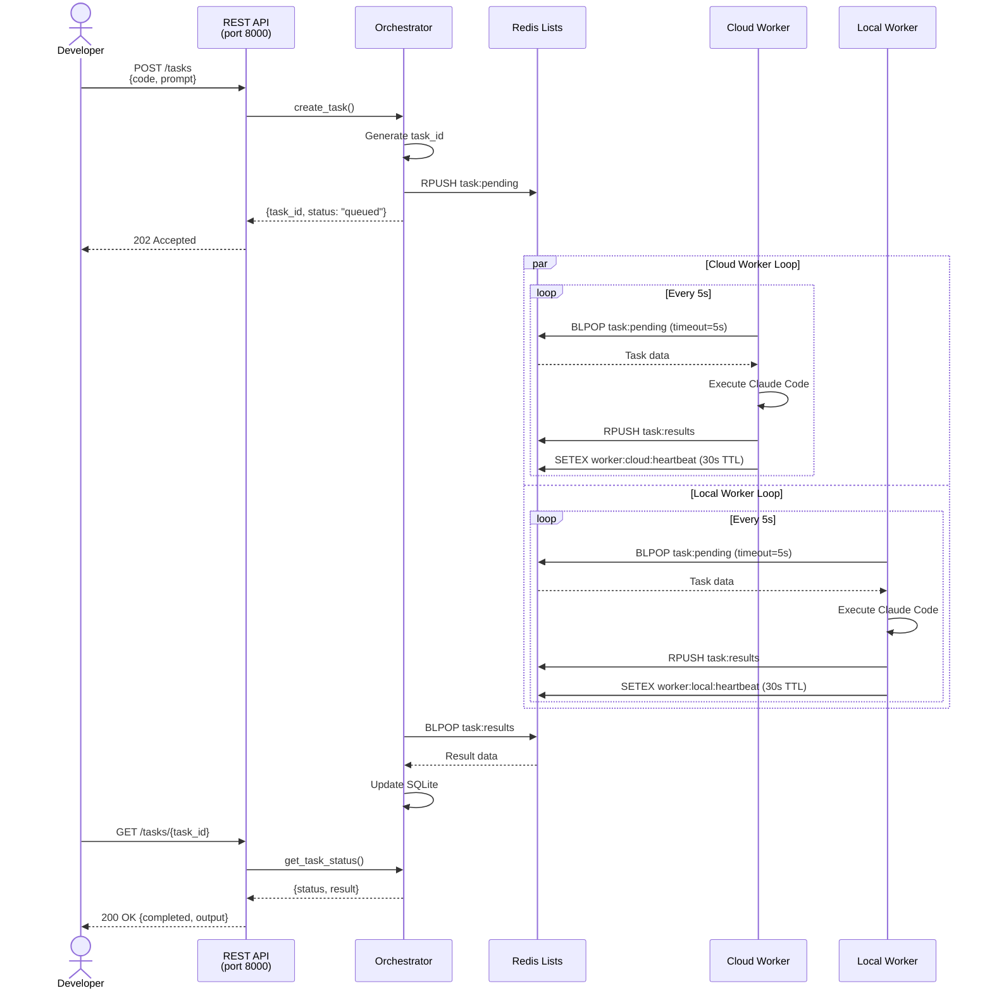

# Claude Orchestrator - Architecture Overview

This document describes the architecture of the Claude Orchestrator system, a distributed task execution platform that allows both cloud-based and local Claude Code workers to process tasks from a central orchestrator.

## System Goal

Enable Claude Code to run in multiple environments (cloud and local developer machines) while coordinating work through a central task orchestrator. This allows for:
- Scalable cloud execution for production workloads
- Local execution on developer machines for testing and development
- Efficient resource utilization across hybrid environments
- Simple task distribution and result collection

## High-Level Architecture

```mermaid
graph TB
    subgraph "Entry Point"
        API[🚪 Simple REST API<br/>FastAPI/Express]
    end

    subgraph "Orchestrator Service<br/>(Single Docker Container)"
        Orch[🎯 Task Orchestrator<br/>Python/Node.js]
        TaskDB[(📊 SQLite DB<br/>tasks.db)]
        WorkerReg[(📋 Worker Registry<br/>in-memory)]
    end

    subgraph "Message Layer<br/>(Redis - Free/Cheap Tier)"
        Redis[(🔴 Redis<br/>Lists as Queues)]
        TaskList[task:pending]
        ResultList[task:results]
        HeartbeatSet[worker:heartbeat]
    end

    subgraph "Cloud Workers<br/>(Minimal Cost)"
        CW1[☁️ Cloud Worker 1<br/>AWS Lambda/t4g.nano]
        CW2[☁️ Cloud Worker 2<br/>Optional]
    end

    subgraph "Local Workers<br/>(Free - Developer Machines)"
        LW1[💻 Local Claude<br/>Python Script]
        LW2[💻 Local Claude<br/>Python Script]
    end

    subgraph "Simple Monitoring"
        Logs[📝 stdout/file logs]
        SimpleMetrics[📊 Simple Dashboard<br/>Redis + HTML]
    end

    API --> Orch
    Orch <--> TaskDB
    Orch <--> WorkerReg
    Orch --> Redis

    Redis --> TaskList
    Redis --> ResultList
    Redis --> HeartbeatSet

    TaskList -.BLPOP.-> CW1
    TaskList -.BLPOP.-> CW2
    TaskList -.BLPOP.-> LW1
    TaskList -.BLPOP.-> LW2

    CW1 -.RPUSH.-> ResultList
    CW2 -.RPUSH.-> ResultList
    LW1 -.RPUSH.-> ResultList
    LW2 -.RPUSH.-> ResultList

    CW1 & CW2 -.SETEX.-> HeartbeatSet
    LW1 & LW2 -.SETEX.-> HeartbeatSet

    ResultList -.BLPOP.-> Orch

    Orch --> Logs
    CW1 & CW2 --> Logs
    LW1 & LW2 --> Logs

    SimpleMetrics --> Redis
    SimpleMetrics --> TaskDB

    style Orch fill:#4A90E2
    style Redis fill:#DC382D
    style TaskList fill:#50C878
    style CW1 fill:#E6E6FA
    style LW1 fill:#FFE4B5
    style SimpleMetrics fill:#FFD700
```



## Core Components

### 1. Orchestrator Service
**Responsibilities:**
- Expose REST API for task submission and status queries
- Store task metadata in SQLite database
- Push tasks to Redis queue
- Collect results from Redis queue
- Track worker health via heartbeats
- Provide dashboard for monitoring

**Technology:** Python + FastAPI + SQLite + Redis client

### 2. Redis Message Layer
**Responsibilities:**
- Queue pending tasks (Redis List: `task:pending`)
- Queue completed results (Redis List: `task:results`)
- Track worker heartbeats (Redis Set with TTL: `worker:{id}:heartbeat`)
- Provide atomic operations for task distribution

**Technology:** Redis 7+ (using Lists and Sets with TTL)

### 3. Worker (Cloud & Local)
**Responsibilities:**
- Poll Redis for available tasks (BLPOP on `task:pending`)
- Execute Claude Code tasks
- Report results back to Redis (RPUSH to `task:results`)
- Send heartbeat signals (SETEX on `worker:{id}:heartbeat`)
- Handle task failures and timeouts

**Technology:** Python script with Claude SDK and Redis client

### 4. Simple Dashboard
**Responsibilities:**
- Display task statistics (pending, running, completed)
- Show active workers
- Provide basic monitoring interface

**Technology:** Static HTML + JavaScript + Redis API

## Data Flow

### Task Submission Flow


## Component Details

### Orchestrator Internal Architecture


## Deployment Architecture

```mermaid
graph TB
    subgraph "Local Machine (for PoC)"
        Docker[🐳 Docker Compose]

        subgraph "Compose Services"
            OrchestratorC[orchestrator<br/>:8000]
            RedisC[redis:7<br/>:6379]
            DashboardC[dashboard<br/>:3000]
        end

        LocalWorker1[💻 Worker Script<br/>python worker.py]
    end

    subgraph "Cloud (Minimal Cost)"
        Lambda[☁️ AWS Lambda<br/>or<br/>DigitalOcean Droplet<br/>$4/month]

        CloudWorker[Worker Script<br/>in container]
    end

    Internet[🌐]

    Docker --> OrchestratorC
    Docker --> RedisC
    Docker --> DashboardC

    OrchestratorC <--> RedisC
    DashboardC <--> RedisC

    LocalWorker1 --> RedisC

    Lambda --> CloudWorker
    CloudWorker --> Internet
    Internet --> RedisC

    Dev[👨‍💻 Developer] --> OrchestratorC
    Dev --> DashboardC

    style OrchestratorC fill:#4A90E2
    style RedisC fill:#DC382D
    style LocalWorker1 fill:#FFE4B5
    style CloudWorker fill:#E6E6FA
```



## Key Design Decisions

### 1. Pull-based Model (Workers Poll for Tasks)
**Why:** More reliable for hybrid environments where local workers may be behind firewalls or have intermittent connectivity. Workers maintain control over when they accept work.

**How:** Workers use Redis BLPOP (blocking pop) to wait for tasks with a timeout, preventing busy-waiting.

### 2. Redis Lists as Queues
**Why:** Simple, atomic operations. Redis provides native support for queue operations (RPUSH/BLPOP) with blocking semantics.

**Alternatives Considered:**
- Kafka/RabbitMQ (too complex for PoC)
- SQS (vendor lock-in, costs)
- PostgreSQL LISTEN/NOTIFY (requires persistent DB connection)

### 3. SQLite for Orchestrator State
**Why:** Zero-cost, serverless, perfect for single-instance orchestrator. Simplifies deployment.

**Migration Path:** Can be replaced with PostgreSQL when scaling to multiple orchestrator instances.

### 4. Stateless Workers
**Why:** Workers can be killed/restarted without state loss. All state lives in Redis and SQLite.

**Benefits:** Easy horizontal scaling, simple error recovery.

### 5. Heartbeat Mechanism
**Why:** Detect dead workers without complex health check infrastructure.

**How:** Workers update Redis keys with TTL every 10 seconds. If key expires, worker is considered dead.

### 6. Blocking Operations
**Why:** Reduce polling overhead and latency.

**How:** Both workers (BLPOP) and orchestrator (BLPOP on results) use blocking Redis operations.

## Data Models

### Task Schema (SQLite)
```sql
CREATE TABLE tasks (
    id TEXT PRIMARY KEY,              -- UUID
    status TEXT NOT NULL,             -- queued, running, completed, failed
    code TEXT,                        -- Code to execute
    prompt TEXT,                      -- Prompt for Claude
    result TEXT,                      -- Execution result (JSON)
    worker_id TEXT,                   -- Which worker processed this
    created_at TIMESTAMP DEFAULT CURRENT_TIMESTAMP,
    started_at TIMESTAMP,
    completed_at TIMESTAMP,
    error_message TEXT
);
```

### Redis Data Structures
```
# Task Queue (List)
task:pending -> ["task_json_1", "task_json_2", ...]

# Result Queue (List)
task:results -> ["result_json_1", "result_json_2", ...]

# Worker Heartbeats (Keys with TTL)
worker:{worker_id}:heartbeat -> "timestamp" (TTL: 30s)

# Worker Info (Hash)
worker:{worker_id}:info -> {type: "cloud|local", started_at: "timestamp", ...}
```

### Task Message Format (JSON)
```json
{
  "task_id": "uuid-here",
  "code": "print('hello world')",
  "prompt": "Execute this code",
  "created_at": "2025-01-15T10:30:00Z",
  "timeout": 300
}
```

### Result Message Format (JSON)
```json
{
  "task_id": "uuid-here",
  "worker_id": "cloud-worker-1",
  "status": "completed",
  "result": {
    "stdout": "hello world\n",
    "stderr": "",
    "exit_code": 0
  },
  "completed_at": "2025-01-15T10:30:15Z",
  "execution_time_ms": 1523
}
```

## API Endpoints

### POST /tasks
Submit a new task for execution.

**Request:**
```json
{
  "code": "print('hello world')",
  "prompt": "Execute this Python code",
  "timeout": 300
}
```

**Response (202 Accepted):**
```json
{
  "task_id": "550e8400-e29b-41d4-a716-446655440000",
  "status": "queued",
  "created_at": "2025-01-15T10:30:00Z"
}
```

### GET /tasks/{task_id}
Get task status and results.

**Response (200 OK):**
```json
{
  "task_id": "550e8400-e29b-41d4-a716-446655440000",
  "status": "completed",
  "result": {
    "stdout": "hello world\n",
    "stderr": "",
    "exit_code": 0
  },
  "worker_id": "local-worker-abc",
  "created_at": "2025-01-15T10:30:00Z",
  "completed_at": "2025-01-15T10:30:15Z"
}
```

### GET /tasks
List all tasks (with optional status filter).

**Query Parameters:**
- `status`: Filter by status (queued, running, completed, failed)
- `limit`: Max results (default: 50)
- `offset`: Pagination offset

**Response (200 OK):**
```json
{
  "tasks": [...],
  "total": 123,
  "limit": 50,
  "offset": 0
}
```

### GET /workers
List active workers.

**Response (200 OK):**
```json
{
  "workers": [
    {
      "worker_id": "cloud-worker-1",
      "type": "cloud",
      "last_heartbeat": "2025-01-15T10:30:45Z",
      "status": "active"
    },
    {
      "worker_id": "local-worker-abc",
      "type": "local",
      "last_heartbeat": "2025-01-15T10:30:43Z",
      "status": "active"
    }
  ]
}
```

### GET /health
Health check endpoint for orchestrator.

**Response (200 OK):**
```json
{
  "status": "healthy",
  "redis_connected": true,
  "database_connected": true,
  "active_workers": 2
}
```

## Error Handling

### Task Timeout
- Workers enforce task timeout (default: 5 minutes)
- If timeout reached, worker reports failure status
- Orchestrator marks task as failed

### Worker Crashes
- Heartbeat expires (30s TTL)
- Orchestrator detects missing worker
- Task remains in queue or gets requeued (future enhancement)

### Redis Connection Loss
- Worker retries connection with exponential backoff
- Orchestrator logs error and attempts reconnection
- Tasks remain in Redis queue (persistent)

### Invalid Task Data
- Orchestrator validates task before queuing
- Worker validates task data before execution
- Validation errors returned immediately (400 Bad Request)

## Scalability Considerations

### Current PoC Limitations
- Single orchestrator instance (no HA)
- SQLite (single writer)
- No task prioritization
- No automatic retries
- Simple round-robin task distribution

### Future Enhancements
1. **Multiple Orchestrator Instances:** Replace SQLite with PostgreSQL, use Redis pub/sub for coordination
2. **Task Priority:** Use multiple Redis lists (high/medium/low priority)
3. **Auto-retry:** Dead letter queue for failed tasks
4. **Worker Pools:** Specialized workers for different task types
5. **Metrics:** Prometheus metrics for monitoring
6. **Auto-scaling:** Scale cloud workers based on queue depth

## Cost Analysis

| Component | Technology | Estimated Cost | Notes |
|-----------|-----------|----------------|-------|
| **Orchestrator** | Docker Compose (local) | $0 | Run on dev machine |
| **Redis** | Upstash free tier | $0 | 10K commands/day limit |
| **Redis** | Upstash Pro | $10/mo | Unlimited commands |
| **Database** | SQLite | $0 | File-based |
| **Local Workers** | Python scripts | $0 | Run on dev machines |
| **Cloud Worker** | DigitalOcean Droplet | $4/mo | 1GB RAM, 1 vCPU |
| **Cloud Worker** | AWS Lambda | ~$0.20/1M requests | Pay per use |
| **Cloud Worker** | fly.io | $0 (free tier) | Limited hours |
| **Dashboard** | Static HTML | $0 | Served by orchestrator |

**Total Cost Range:** $0 - $14/month depending on choices

## Security Considerations

### Current PoC (Basic Security)
- API key authentication for REST API
- Redis password authentication
- No encryption in transit (local network)

### Production Requirements
- TLS/SSL for all connections
- OAuth2/JWT for API authentication
- Redis TLS mode
- Network segmentation (VPN for local workers)
- Input sanitization (prevent code injection)
- Rate limiting on API endpoints
- Audit logging for task execution

## Monitoring and Observability

### PoC Monitoring
- stdout logs from all components
- Simple dashboard showing:
  - Task count by status
  - Active workers
  - Recent task history
  - Queue depth

### Future Observability
- Structured logging (JSON logs)
- Distributed tracing (OpenTelemetry)
- Metrics (Prometheus/Grafana)
  - Task processing time
  - Queue depth over time
  - Worker utilization
  - Error rates
- Alerting (PagerDuty/OpsGenie)
  - High queue depth
  - Worker crashes
  - API errors

## Development Workflow

1. **Local Development:**
   - Run orchestrator via Docker Compose
   - Run Redis locally
   - Run worker script locally
   - Submit tasks via curl/Postman

2. **Testing:**
   - Unit tests for orchestrator components
   - Integration tests for Redis operations
   - End-to-end tests for complete task flow

3. **Deployment:**
   - Docker image for orchestrator
   - Python script for worker (with dependencies)
   - Deploy cloud worker to chosen platform
   - Configure Redis connection strings

## Next Steps

See [tasks/](../tasks/) folder for detailed implementation tasks broken down for junior developers.

Key milestones:
1. ✅ Design architecture
2. 🏗️ Implement orchestrator service
3. 🏗️ Implement worker script
4. 🏗️ Create Docker Compose setup
5. 🏗️ Build simple dashboard
6. 🏗️ Deploy cloud worker
7. 🏗️ End-to-end testing
8. 📚 Documentation completion